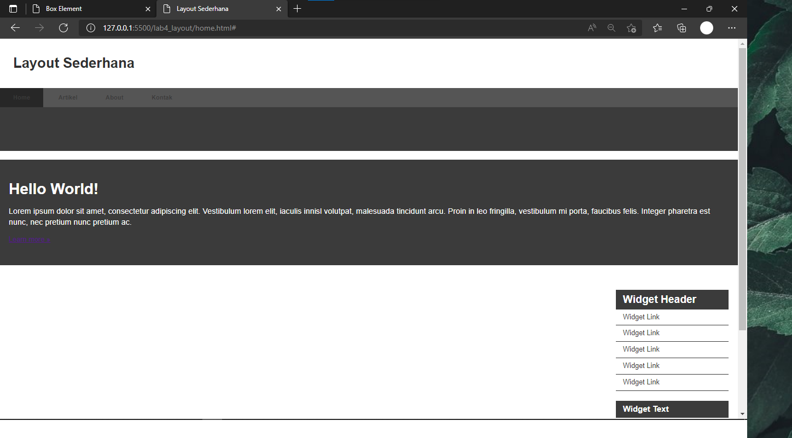
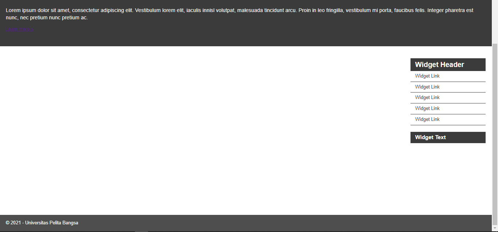
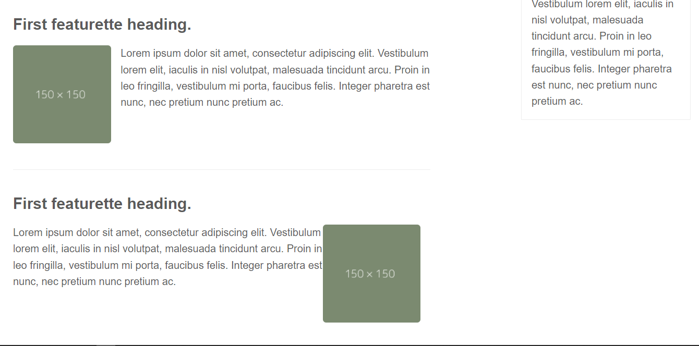

## Nama     : Moh. Taufik Rauf
## NIM      : 312010151
## Kelas    : TI.20.A.1

---
# Box Element
Element HTML dapat dianggap sebagai sebuah Box atau kotak. Box tersebut digunakan untuk
membuat layout web. Pada dasarnya semua element HTML adalah box dengan beberapa perbedaan.
Ada yang floating ada juga yang tanpa floating.

Langkah pertama membuat Box Element.

Persiapkan text editor misalnya VSCode.

Buatlah dokumen HTML dengan nama file lab4_box.html, lalu masukan contoh kode berikut.

```
<!DOCTYPE html>
<html lang="en">
<head>
    <meta charset="UTF-8">
    <meta name="viewport" content="width=device-width, initial-scale=1.0">
    <title>Box Element</title>
</head>
<body>
    <header>
        <h1>Box Element</h1>
    </header>
</body>
</html>
```

Kemudian tambahkan kode untuk membuat box element dengan tag div seperti berikut.
```
<section>
    <div class="div1">Div 1</div>
    <div class="div2">Div 2</div>
    <div class="div3">Div 3</div>
</section>
```
Selanjutnya tambahkan deklarasi CSS pada head untuk membuat float element, seperti berikut.
```
<style>
    div {
        float:left;
        padding: 10px;
    }
    .div1 {
        background: rgb(94, 94, 94);
    }
    .div2 {
        background: rgb(56, 56, 56);
    }
    .div3 {
        background: rgb(36, 36, 36);
    }
</style>
```
Kemudian buka browser untuk melihat hasilnya.

Berikut contoh tampilannya


Mengatur Clearfix Element
Clearfix digunakan untuk mengatur element setelah float element. Property clear digunakan untuk
mengaturnya.
Tambahkan element div lainnya seteleah div3 seperti berikut.
```
<div class="div4">Div 4</div>
```
Kemudian atur property clear pada CSS, seperti berikut.
```
.div4 {
    background-color: rgb(32, 32, 32);
    clear: left;
    float: none;
}
```
Selanjutnya buka browser dan refresh kembali.

Berikut contoh tampilannya.


Lakukan eksperimen terhadap penggunaan property clear dengan nilai lainnya (left, both, right),
dan amati perubahannya.

Berikut contoh perubahannya.


# Layout Sederhana
Selanjunya kita akan membuat Leyout Sederhana. Buat folder baru dengan nama lab4_layout, kemudian buatlah file baru didalamnya dengan nama
home.html, dan file css dengan nama style.css.

selanjutnya masukan contoh kode berikut.
```
<!DOCTYPE html>
<html lang="en">
<head>
    <meta charset="UTF-8">
    <meta name="viewport" content="width=device-width, initial-scale=1.0">
    <title>Layout Sederhana</title>
    <link rel="stylesheet" href="style.css">
</head>
<body>
    <div id="container">
    </div>
</body>
</html>
```
Kemudian masukan kode berikut.
```
    <header>
        <h1>Layout Sederhana</h1>
    </header>
    <nav>
        <a href="home.html" class="active">Home</a>
        <a href="artikel.html">Artikel</a>
        <a href="about.html">About</a>
        <a href="kontak.html">Kontak</a>
    </nav>
    <section id="hero"></section>
    <section id="wrapper">
        <section id="main"></section>
        <aside id="sidebar"></aside>
    </section>
    <footer>
    <p>&copy; 2021 - Universitas Pelita Bangsa</p>
    </footer>
```
Berikut contoh tampilan Browsernya.


Kemudian tambahkan kode berikut di file CSS.

```
* {
    margin: 0;
    padding: 0;
    }
body {
    line-height:1;
    font-size:100%;
    font-family:'Open Sans', sans-serif;
    color:#5a5a5a;
}
#container {
    width: 980px;
    margin: 0 auto;
    box-shadow: 0 0 1em #cccccc;
}
header {
    padding: 20px;
}
header h1 {
    margin: 20px 10px;
    color: #b5b5b5;
}
```
Berikut contoh tampilan.


## Mengatur Navigasi.

Kemudian masukan kode berikut.
```
nav {
    display: block;
    background-color: #555555;
}
nav a {
    padding: 15px 30px;
    display: inline-block;
    color: #3b3b3b;
    font-size: 14px;
    text-decoration: none;
    font-weight: bold;
}
nav a.active,
nav a:hover {
    background-color: #272727;
}
```
Berikut tampilan perubahannya.


## Membuat Hero Panel.

Selanjutnya membuat hero panel. Tambahkan kode HTML dan CSS seperti berikut.
```
<section id="hero">
        <h1>Hello World!</h1>
        <p>Lorem ipsum dolor sit amet, consectetur adipiscing elit. Vestibulum lorem
        elit, iaculis innisl volutpat, malesuada tincidunt arcu. Proin in leo fringilla,
        vestibulum mi porta, faucibus felis. Integer pharetra est nunc, nec pretium nunc
        pretium ac.</p>
        <a href="home.html" class="btn btn-large">Learn more &raquo;</a>
</section>
```
```
#hero {
    background-color: #3b3b3b;
    padding: 50px 20px;
    margin-bottom: 20px;
}
#hero h1 {
    margin-bottom: 20px;
    font-size: 35px;
}
#hero p {
    margin-bottom: 20px;
    font-size: 18px;
    line-height: 25px;
}
```
Berikut tampilannya.


## Mengatur Layout Main dan Sidebar
Selanjutnya mengatur main content dan sidebar, tambahkan CSS float.
```
#wrapper {
    margin: 0;
}
```
```
#main {
    float: left;
    width: 640px;
    padding: 20px;
}
#sidebar {
    float: left;
    width: 260px;
    padding: 20px;
}
```
## Membuat Sidebar Widget
Kemudian selanjutnya menambahkan element lain dalam sidebar.

```
<aside id="sidebar">
    <div class="widget-box">
        <h3 class="title">Widget Header</h3>
        <ul>
            <li><a href="#">Widget Link</a></li>
            <li><a href="#">Widget Link</a></li>
            <li><a href="#">Widget Link</a></li>
            <li><a href="#">Widget Link</a></li>
            <li><a href="#">Widget Link</a></li>
        </ul>
    </div>
    <div class="widget-box">
        <h3 class="title">Widget Text</h3>
        <p>Vestibulum lorem elit, iaculis in nisl volutpat, malesuada tincidunt
arcu. Proin in leo fringilla, vestibulum mi porta, faucibus felis. Integer
pharetra est nunc, nec pretium nunc pretium ac.</p>
    </div>
</aside>
```
Kemudian tambahkan CSS.

```
.widget-box {
    border:1px solid rgb(255, 255, 255);
    margin-bottom:20px;
    }
.widget-box .title {
    padding:10px 16px;
    background-color:#3b3b3b;
    color:rgb(255, 255, 255);
    }
.widget-box ul {
    list-style-type:none;
    }
.widget-box li {
    border-bottom:1px solid rgb(255, 255, 255);
}
.widget-box li a {
    padding:10px 16px;
    color:#3b3b3b;
    display:block;
    text-decoration:none;
}
.widget-box li:hover a {
    background-color:rgb(255, 255, 255);
}
.widget-box p {
    padding:15px;
    line-height:25px;
}
```
Bwrikut tampilannya.



## Mengatur Footer
Selanjutnya mengatur tampilan footer. Tambahkan CSS untuk footer.

```
<footer>
    <p>&copy; 2021 - Universitas Pelita Bangsa</p>
        <style>footer {
            clear:both;
            background-color:#4e4e4e;
            padding:20px;
            color:rgb(255, 255, 255);
        }
        </style>
</footer>
```

Berikut tampilannya.


## Menambahkan Elemen lainnya pada Main Content

```
<section id="main">
    <div class="row">
        <div class="box">
            
            <h3>Heading</h3>
        <p>Donec sed odio dui. Etiam porta sem malesuada magna mollis
euismod.</p>
            <a href="#" class="btn btn-default">View detail</a>
        </div>
        <div class="box">
            
        <h3>Heading</h3>
        <p>Donec sed odio dui. Etiam porta sem malesuada magna mollis
euismod.</p>
            <a href="#" class="btn btn-default">View detail</a>
    </div>
    <div class="box">
        
            <h3>Heading</h3>
            <p>Donec sed odio dui. Etiam porta sem malesuada magna mollis
euismod.</p>
            <a href="#" class="btn btn-default">View detail</a>
        </div>
    </div>
</section>
```

Kemudian tambahkan CSS.

```
.box {
    display:block;
    float:right;
    width:33.333333%;
    box-sizing:border-box;
    -moz-box-sizing:border-box;
    -webkit-box-sizing:border-box;
    padding:0 10px;
    text-align:center;
    }
    .box h3 {
    margin: 15px 0;
    }
    .box p {
    line-height: 20px;
    font-size: 14px;
    margin-bottom: 15px;
    }
    box img {
    border: 0;
    vertical-align: middle;
    }
    .image-circle {
    border-radius: 50%;
    }
    .row {
    margin: 0 -10px;
    box-sizing: border-box;
    -moz-box-sizing: border-box;
    -webkit-box-sizing: border-box;
    }
    .row:after, .row:before,
    .entry:after, .entry:before {
    content:'';
    display:table;
    }
    .row:after,
    .entry:after {
    clear:both;
    }
```

Berikut lihat perubahannya.


## Menambahkan Content Artikel
Selanjutnya membuat content artikel. Tambahkan HTML berikut pada main content.

```
<hr class="divider" />
<article class="entry">
    <h2>First featurette heading.</h2>
        
<p>Lorem ipsum dolor sit amet, consectetur adipiscing elit. Vestibulum lorem
elit, iaculis in nisl volutpat, malesuada tincidunt arcu. Proin in leo fringilla,
vestibulum mi porta, faucibus felis. Integer pharetra est nunc, nec pretium nunc
pretium ac.</p>
</article>
    <hr class="divider" />
<article class="entry">
    <h2>First featurette heading.</h2>
        
<p>Lorem ipsum dolor sit amet, consectetur adipiscing elit. Vestibulum lorem
elit, iaculis in nisl volutpat, malesuada tincidunt arcu. Proin in leo fringilla,
vestibulum mi porta, faucibus felis. Integer pharetra est nunc, nec pretium nunc
pretium ac.</p>
</article>
```

Kemudian tambahkan CSS.

```
.divider {
    border: 0;
    border-top: 1px solid #eeeeee;
    margin: 40px 0;
}

.entry {
    margin: 15px 0;
}
.entry h2 {
    margin-bottom: 20px;
}
.entry p {
    line-height: 25px;
}
.entry img {
    float: left;
    border-radius: 5px;
    margin-right: 15px;
}
.entry .right-img {
    float: right;
}
```

Berikut tampilannya.



# TERIMA KASIH